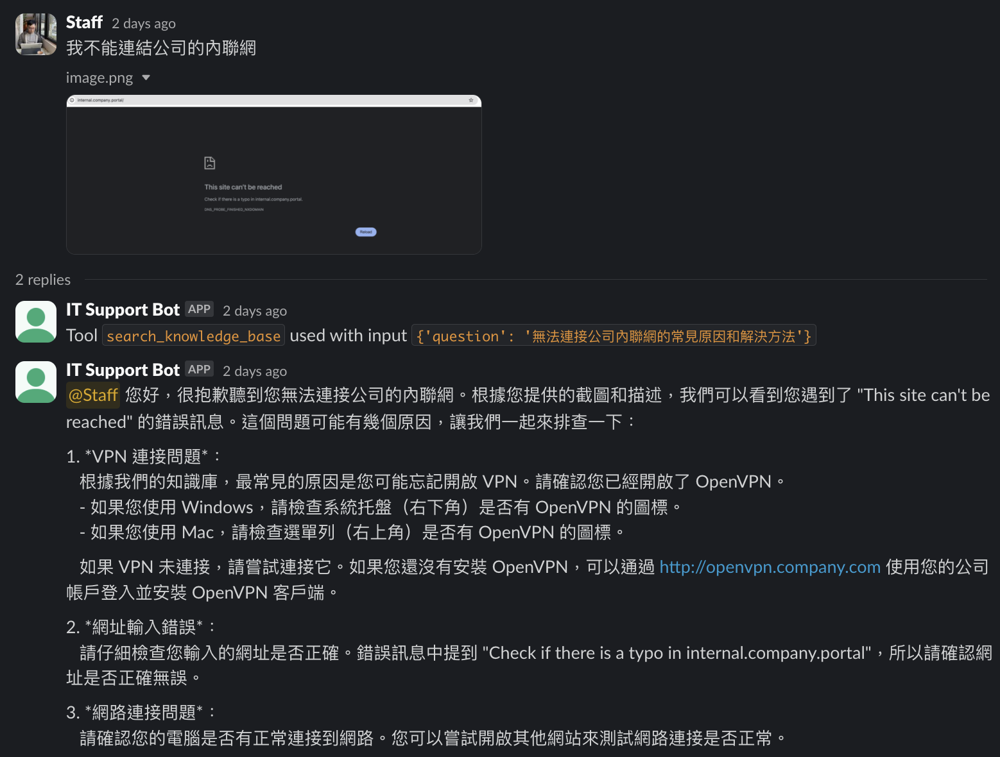
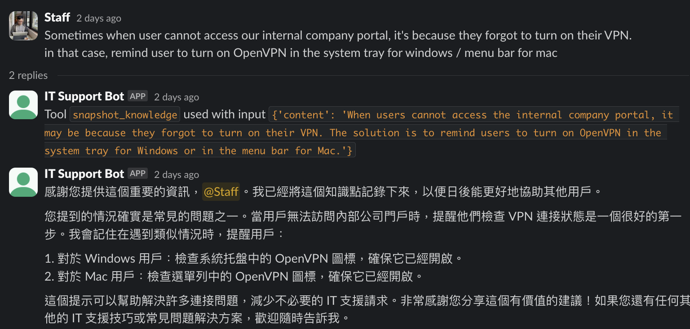
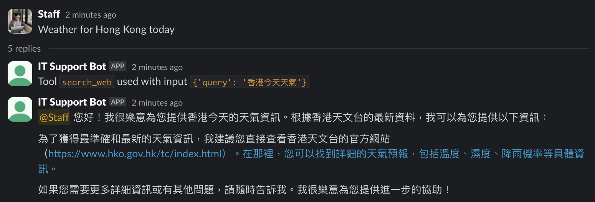

# self-learning-rag-it-support-slackbot

## Services and Features Used

- Amazon Bedrock
    - Claude 3.5 Sonnet, Mistral Large 2407 or Llama 3.1 for LLM
    - Titan Text Embeddings V2 for RAG
    - Converse API to:
        - accept multi-modal input
        - perform tools use/function calling
- AWS Serverless Application Model (SAM)
    - AWS API Gateway for public facing HTTPS endpoint
    - AWS Lambda for serverless compute
- Amazon Aurora Serverless v2 with PostgreSQL compatibility

## Examples

Tool Usage | Demo
---|---
Answer with Knowledge Base | 
Snapshot new knowledge | 
Search on Web | 

## Pre-requisites

- VPC and Private Subnets - you will need at least one NAT Gateway to allow the Lambda function to access the internet within the private subnets in order to connect to the Aurora Serverless DB as well as the internet for web search/URL retrieval.
- In Amazon Bedrock Console (`us-east-1` region), enable Amazon Titan Text Embeddings V2.
- In Amazon Bedrock Console (`us-west-2` region), enable Claude 3.5 Sonnet, Mistral Large 2407 or Llama 3.1 model.

## Setup

1. Create a new Slack App
2. Configure the relevant Slack OAuth bot user scopes, install the app to your workspace
    - `chat:write`, `im:history` and `im:write`
3. Copy `.env.example` to `.env` and fill in the relevant values
4. Configure AWS CLI with the relevant profile/access key pair
5. Run `./deploy.sh` to deploy the stack

   ```
   CloudFormation outputs from deployed stack
   -------------------------------------------------------------------
   Outputs
   -------------------------------------------------------------------
   Key                 SlackEventUrl
   Description         URL of the API Gateway endpoint
   Value               https://<your-apigw-id-here>.execute-api.us-east-1.amazonaws.com/live/webhook/events
   ```
6. Go to Aurora Query Editor of RDS, configure a new connection with your DB credentials (Database name is defaulted to be `postgres`), then run the SQL in `init_db.sql`.
7. Go to the Slack App settings and configure the Request URL to the API Gateway endpoint.
    - In app settings, go to "Event Subscriptions", "Enable Events"
    - Paste the value of "SlackEventUrl" into the "Request URL" field
    - Wait until you see a green text "Verified" with a green check mark.
    - Select "Subscribe to bot events", add `message.channels`, or `message.groups`, `message.im` and `message.mpim` depending on your choice.
    - Save.
8. Invite the bot to your Slack workspace's channels and start chatting with it!

## Development

- Install the dependencies in `requirements-dev.txt`, it contains the necessary typing stubs for `boto3` particularly for `bedrock-runtime`.

## FAQ

- `requirements.txt file not found. Continuing the build without dependencies.` - you can safely ignore it as the dependencies are already installed in the Lambda layer. However to supress this warning, you can create an empty `requirements.txt` file in the `./function` directory.
